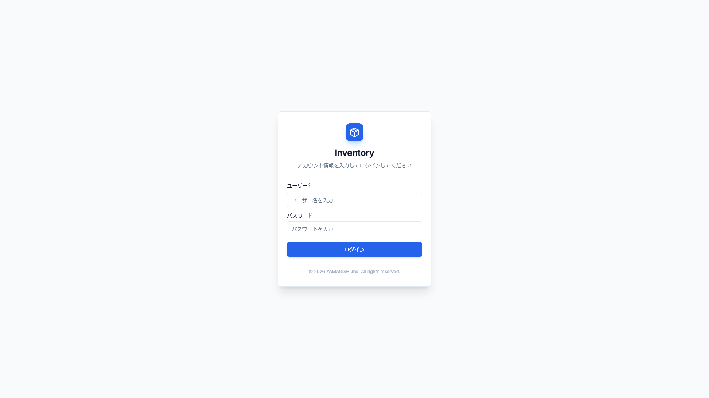

# スクリーンショット撮影ガイド

ユーザーマニュアル用のスクリーンショットを撮影するためのガイドです。

## 📋 必要なスクリーンショット一覧

以下の14種類のスクリーンショットが必要です：

- [x] `01-login.png` - ログイン画面 ✅ 撮影済み（本番環境）
- [x] `02-dashboard.png` - ダッシュボード ✅ 撮影済み（本番環境）
- [x] `03-items-list-product.png` - アイテム一覧（商品タブ） ✅ 撮影済み（本番環境）
- [x] `04-items-list-consignment.png` - アイテム一覧（委託品タブ） ✅ 撮影済み（本番環境）
- [x] `05-items-grid-view.png` - グリッドビュー ✅ 撮影済み（本番環境）
- [x] `06-item-detail.png` - アイテム詳細 ✅ 撮影済み（本番環境）
- [x] `07-item-edit.png` - アイテム編集 ✅ 撮影済み（本番環境）
- [x] `08-item-new.png` - アイテム新規登録 ✅ 撮影済み（本番環境）
- [x] `09-manufacturers.png` - メーカー管理 ✅ 撮影済み（本番環境）
- [x] `10-categories.png` - 品目管理 ✅ 撮影済み（本番環境）
- [x] `11-locations.png` - 場所管理 ✅ 撮影済み（本番環境）
- [x] `12-tags.png` - タグ管理 ✅ 撮影済み（本番環境）
- [x] `13-material-types.png` - 素材項目管理 ✅ 撮影済み（本番環境）
- [x] `14-admin-console.png` - ユーザー管理 ✅ 撮影済み（本番環境）

## 🛠️ 撮影方法

### 方法1: 自動スクリプトを使用（推奨）

#### 前提条件

1. 開発サーバーが起動している
2. データベースにシードデータが投入されている
3. 管理者ユーザー（admin/admin123）が存在する

#### 実行手順

```bash
# 開発サーバーを起動（別ターミナル）
npm run dev

# サーバー起動を待つ（15秒程度）

# スクリプトを実行
npx tsx scripts/capture-screenshots.ts
```

#### トラブルシューティング

もしスクリプトがタイムアウトする場合は、以下を試してください：

**1. データベースとシードの確認**

```bash
# データベースリセット＆マイグレーション
npm run db:migrate:reset

# シードデータ投入
npm run db:seed
```

**2. Playwrightブラウザの再インストール**

```bash
npx playwright install chromium
```

**3. スクリプトのデバッグモード実行**

`scripts/capture-screenshots.ts` の `headless: true` を `headless: false` に変更して、ブラウザの動作を目視確認してください。

```typescript
const browser = await chromium.launch({ headless: false }); // デバッグモード
```

### 方法2: 手動撮影

自動スクリプトがうまく動作しない場合は、手動で撮影してください。

#### 準備

1. ブラウザ（Chrome推奨）を起動
2. http://localhost:3000 にアクセス
3. 開発者ツール（F12）を開く
4. デバイスツールバー（Ctrl+Shift+M）で解像度を **1920x1080** に設定

#### 撮影手順

各画面に遷移し、以下の手順でスクリーンショットを撮影します：

**Windows:**
- `Win + Shift + S` でスクリーンショットツールを起動
- 範囲を選択して撮影

**Mac:**
- `Cmd + Shift + 4` でスクリーンショットツールを起動
- 範囲を選択して撮影

**ブラウザ拡張機能（推奨）:**
- Awesome Screenshot などの拡張機能を使用すると、フルページスクリーンショットが簡単に撮影できます

#### 画面ごとの撮影ポイント

##### 1. ログイン画面 (`01-login.png`) ✅ 撮影済み

- URL: http://localhost:3000/login
- 撮影範囲: ログインフォーム全体

##### 2. ダッシュボード (`02-dashboard.png`)

- URL: http://localhost:3000/dashboard
- 撮影範囲: フルページ
- ポイント:
  - 統計カード（商品総数、委託品総数など）が表示されている
  - メーカー別原価合計グラフが表示されている
  - 最近の変更が表示されている

##### 3. アイテム一覧 - 商品タブ (`03-items-list-product.png`)

- URL: http://localhost:3000/items?type=PRODUCT
- 撮影範囲: フルページ
- ポイント:
  - 「商品」タブが選択されている
  - テーブルビューで表示されている
  - 複数の商品が表示されている

##### 4. アイテム一覧 - 委託品タブ (`04-items-list-consignment.png`)

- URL: http://localhost:3000/items?type=CONSIGNMENT
- または、商品タブから「委託品」タブをクリック
- 撮影範囲: フルページ
- ポイント:
  - 「委託品」タブが選択されている
  - 委託品が表示されている（原価がnull）

##### 5. グリッドビュー (`05-items-grid-view.png`)

- URL: http://localhost:3000/items?type=PRODUCT
- ビュー切り替えボタンでグリッドビューに切り替え
- 撮影範囲: フルページ
- ポイント:
  - 2列のカード形式で表示されている
  - 商品画像が表示されている

##### 6. アイテム詳細 (`06-item-detail.png`)

- URL: http://localhost:3000/items/[任意のアイテムID]
- 撮影範囲: フルページ
- ポイント:
  - 基本情報が表示されている
  - 画像ギャラリーが表示されている
  - 素材情報が表示されている
  - タグが表示されている

##### 7. アイテム編集 (`07-item-edit.png`)

- URL: http://localhost:3000/items/[任意のアイテムID]/edit
- 撮影範囲: フルページ
- ポイント:
  - 編集フォームが表示されている
  - 画像アップロードエリアが表示されている
  - 素材情報エディタが表示されている

##### 8. アイテム新規登録 (`08-item-new.png`)

- URL: http://localhost:3000/items/new
- 撮影範囲: フルページ
- ポイント:
  - 新規登録フォームが表示されている
  - 種別選択（商品/委託品）が表示されている

##### 9. メーカー管理 (`09-manufacturers.png`)

- URL: http://localhost:3000/manufacturers
- 撮影範囲: フルページ
- ポイント:
  - メーカー一覧が表示されている
  - アイテム数が表示されている
  - 新規登録ボタンが表示されている

##### 10. 品目管理 (`10-categories.png`)

- URL: http://localhost:3000/categories
- 撮影範囲: フルページ

##### 11. 場所管理 (`11-locations.png`)

- URL: http://localhost:3000/locations
- 撮影範囲: フルページ

##### 12. タグ管理 (`12-tags.png`)

- URL: http://localhost:3000/tags
- 撮影範囲: フルページ

##### 13. 素材項目管理 (`13-material-types.png`)

- URL: http://localhost:3000/material-types
- 撮影範囲: フルページ
- ポイント:
  - 素材項目一覧が表示されている
  - 表示順が表示されている

##### 14. ユーザー管理 (`14-admin-console.png`)

- URL: http://localhost:3000/admin/console
- 撮影範囲: フルページ
- ポイント:
  - ユーザー一覧が表示されている
  - ロールバッジが表示されている（ADMIN/USER）

## 📸 撮影のベストプラクティス

### 解像度とサイズ

- **推奨解像度**: 1920x1080
- **最小解像度**: 1280x720
- **ファイル形式**: PNG（可逆圧縮）
- **最適化**: TinyPNG などで圧縮（任意）

### データの準備

- **サンプルデータ**: 実際のデータに近い内容を使用
- **日本語**: 商品名や説明は日本語で記入
- **画像**: サンプル画像を登録（商品画像、素材画像）
- **複数件**: 一覧画面では複数件（5-10件程度）表示されている状態が理想

### UI の状態

- **メニュー**: 閉じた状態（特に指定がない場合）
- **ダイアログ**: 閉じた状態
- **ホバー**: マウスホバー状態は避ける
- **選択**: チェックボックス等は未選択の状態
- **エラー**: エラーメッセージは表示しない（特に指定がない場合）

### ブラウザ

- **推奨**: Google Chrome 最新版
- **開発者ツール**: スクリーンショットに含めない
- **拡張機能**: 広告ブロッカー等は無効化
- **ズーム**: 100%（Ctrl+0でリセット）

## 🔄 撮影後の確認

撮影後、以下を確認してください：

1. ファイル名が正しいか
2. 解像度が適切か（最低1280px幅以上）
3. 画面全体が写っているか
4. 文字が読めるか
5. UIが正しく表示されているか

## 📝 マニュアルへの反映

撮影したスクリーンショットは、以下のパスに配置してください：

```
docs/screenshots/
├── 01-login.png
├── 02-dashboard.png
├── 03-items-list-product.png
├── ...
└── 14-admin-console.png
```

マニュアル（`docs/USER_MANUAL.md`）では、以下の形式で参照されています：

```markdown

```

相対パスで参照されているため、`docs/screenshots/` ディレクトリに配置すれば自動的に表示されます。

## ❓ よくある質問

**Q: スクリーンショットが真っ白になる**

A: ページの読み込みが完了するまで待ってから撮影してください。ネットワークタブで「Finished」になるまで待ちます。

**Q: フォントが汚い**

A: ブラウザのズームが100%であることを確認してください。また、高DPIディスプレイの場合は、Windowsの表示スケールを100%に設定してください（推奨）。

**Q: 画像が大きすぎる**

A: PNG形式のままでも、TinyPNG などのオンラインツールで50-70%程度圧縮できます。

**Q: ダークモードで撮影してもいいですか？**

A: いいえ、ライトモード（デフォルト）で統一してください。

## 🎨 画像最適化（任意）

撮影後、以下のツールで画像を最適化できます：

**オンラインツール:**
- [TinyPNG](https://tinypng.com/) - PNG圧縮
- [Squoosh](https://squoosh.app/) - 画像圧縮・変換

**CLIツール:**
```bash
# ImageMagickで一括リサイズ
mogrify -resize 1920x1080 *.png

# pngquantで圧縮
pngquant --quality=65-80 *.png
```

---

**撮影が完了したら、このファイルのチェックリストを更新してください！** ✅
