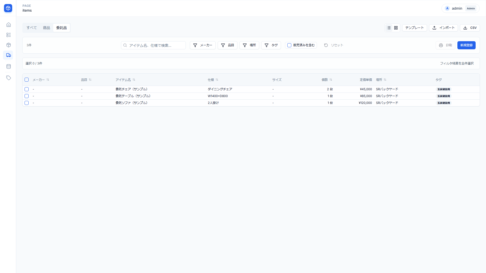
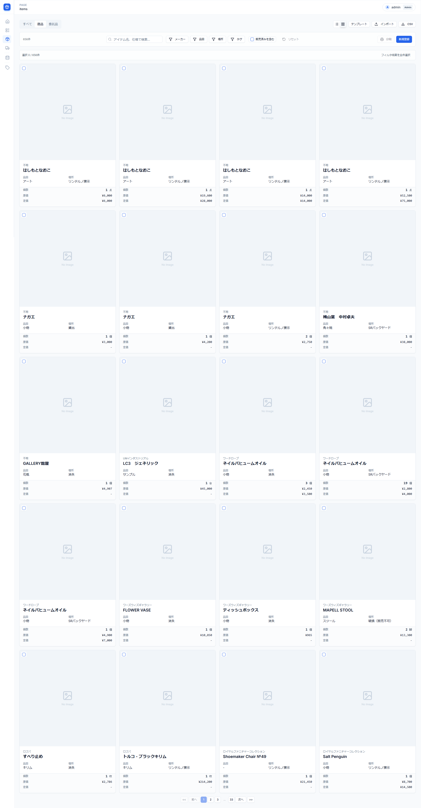
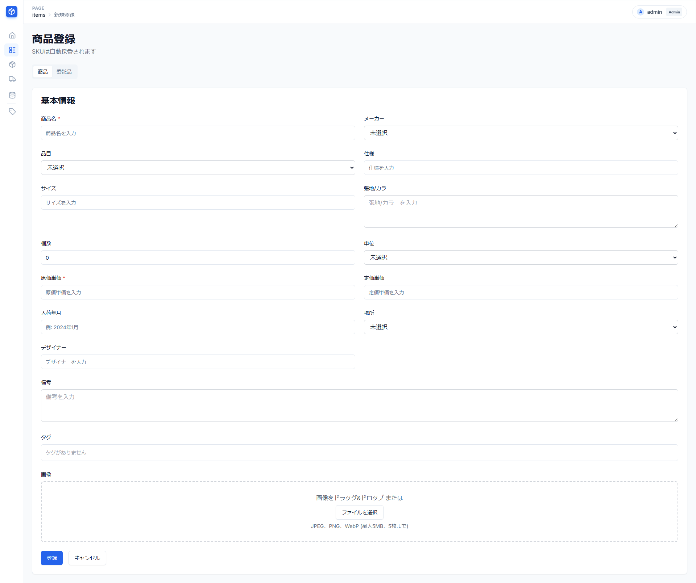
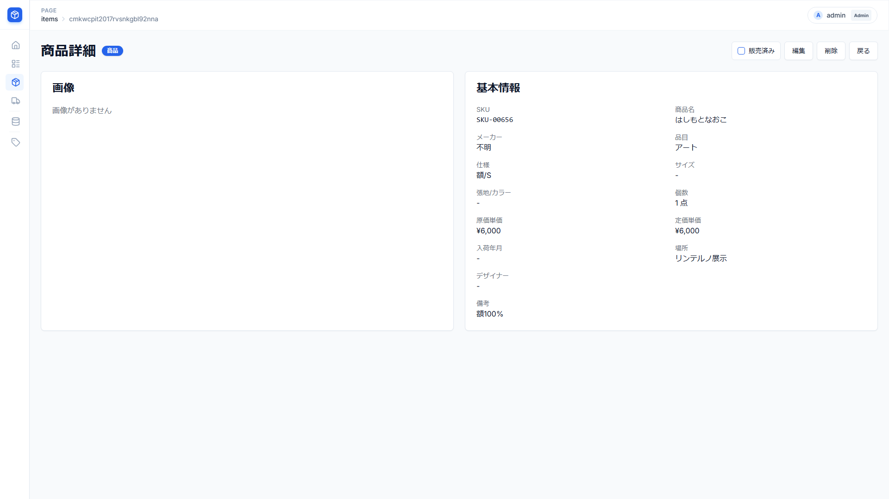
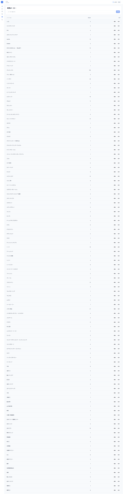
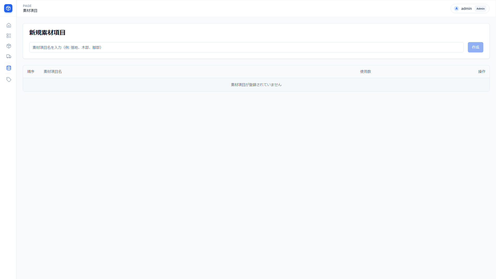

# Inventory - 在庫管理システム ユーザーマニュアル

**バージョン**: 3.0
**最終更新**: 2026年2月13日

---

## アクセス情報

- **URL**: https://inventory-main.vercel.app
- **ユーザー名**: linterno
- **パスワード**: 0762527583

---

## 目次

1. [はじめに](#1-はじめに)
2. [ログイン](#2-ログイン)
3. [ダッシュボード](#3-ダッシュボード)
4. [アイテム管理（商品・委託品）](#4-アイテム管理商品委託品)
   - 4.1 [アイテム一覧の見方](#41-アイテム一覧の見方)
   - 4.2 [アイテムの検索とフィルタ](#42-アイテムの検索とフィルタ)
   - 4.3 [ビューの切り替え（テーブル/グリッド）](#43-ビューの切り替えテーブルグリッド)
   - 4.4 [アイテムの新規登録](#44-アイテムの新規登録)
   - 4.5 [アイテムの詳細表示](#45-アイテムの詳細表示)
   - 4.6 [アイテムの編集](#46-アイテムの編集)
   - 4.7 [アイテムの削除](#47-アイテムの削除)
   - 4.8 [一括操作](#48-一括操作)
   - 4.9 [CSV インポート/エクスポート](#49-csv-インポートエクスポート)
   - 4.10 [印刷機能](#410-印刷機能)
5. [マスタデータ管理](#5-マスタデータ管理)
   - 5.1 [メーカー管理](#51-メーカー管理)
   - 5.2 [品目管理](#52-品目管理)
   - 5.3 [場所管理](#53-場所管理)
   - 5.4 [単位管理](#54-単位管理)
6. [タグ管理](#6-タグ管理)
7. [素材管理](#7-素材管理)
8. [ユーザー管理（管理者のみ）](#8-ユーザー管理管理者のみ)
9. [よくある質問（FAQ）](#9-よくある質問faq)
10. [トラブルシューティング](#10-トラブルシューティング)

---

## 1. はじめに

### 1.1 Inventoryとは

Inventoryは、個人・小規模ビジネス向けのシンプルで使いやすい在庫管理システムです。商品や委託品の管理を中心に、メーカー、品目、保管場所、タグ、素材情報などを一元管理できます。

### 1.2 主な機能

- **アイテム管理**: 商品と委託品を統合して管理
- **SKU自動採番**: 商品（SKU-00001）、委託品（CSG-00001）を自動採番
- **画像管理**: 1つのアイテムに最大5枚の画像を登録
- **素材管理**: 張地、木部などの素材情報と画像を管理
- **タグ機能**: 複数のタグでアイテムを分類
- **検索・フィルタ**: 多様な条件でアイテムを絞り込み
- **一括操作**: 複数アイテムの一括編集・削除
- **CSV機能**: データのインポート/エクスポート
- **印刷機能**: A4レイアウトで印刷（2列×2行）
- **ダッシュボード**: 統計情報とメーカー別原価集計
- **変更履歴**: すべての変更を記録

### 1.3 用語集

| 用語               | 説明                                                   |
| ------------------ | ------------------------------------------------------ |
| **商品**     | 仕入れ商品。原価が設定される（itemType: PRODUCT）      |
| **委託品**   | 委託販売品。原価はnull（itemType: CONSIGNMENT）        |
| **SKU**      | 在庫管理番号（Stock Keeping Unit）。システムが自動採番 |
| **メーカー** | 仕入先またはブランド名                                 |
| **品目**     | 商品の分類（例: ソファ、チェア、テーブル）             |
| **場所**     | 保管場所（例: 倉庫A、展示室）                          |
| **単位**     | 数量の単位（例: 台、個、枚）                           |
| **タグ**     | アイテムに付与する分類ラベル（複数付与可能）           |
| **素材項目** | 素材の種類（例: 張地、木部、金具）                     |

### 1.4 対象ユーザー

- **ADMIN（管理者）**: すべての機能にアクセス可能。ユーザー管理も実行可能
- **USER（一般ユーザー）**: アイテムとマスタデータの管理が可能。ユーザー管理は不可

---

## 2. ログイン

### 2.1 ログイン画面

アプリケーションにアクセスすると、ログイン画面が表示されます。

### 2.2 ログイン方法

1. **ユーザー名**を入力します
2. **パスワード**を入力します
3. **ログイン**ボタンをクリックします

> **初回ログイン情報**
> ユーザー名とパスワードは、システム管理者から提供された情報を使用してください。

### 2.3 ログイン後

ログインに成功すると、ダッシュボード画面が表示されます。

### 2.4 セキュリティについて

- セッションは7日間有効です
- 一定期間操作がない場合、自動的にログアウトされます
- パスワードは定期的に変更することを推奨します

---

## 3. ダッシュボード

### 3.1 ダッシュボードの概要

ダッシュボードでは、在庫の全体像を一目で把握できます。

### 3.2 統計カード

画面左上には、以下の統計情報がカード形式で表示されます：

- **原価合計**: 全商品の原価合計金額（委託品は含まれません）
- **アイテム数**: 商品総数と委託品数

### 3.3 運用ルール

画面右上には、管理者が設定した運用ルールが表示されます。管理者は編集アイコン（ペンマーク）をクリックしてルールを編集できます。

### 3.4 メーカー別原価合計

メーカーごとの原価合計が表形式で表示されます。

- **昇順/降順**: 右上のソートボタンで並び替えができます
- メーカー名と原価合計が一覧表示されます

### 3.5 変更履歴

最近の変更（作成・編集・削除）が表示されます。

- 各エントリにはアクション種別（作成/編集/削除）がバッジで表示されます
- アイテム名、SKU、変更日時、変更者が確認できます

---

## 4. アイテム管理（商品・委託品）

v3.0では、商品と委託品が統合され、「アイテム」として一元管理されるようになりました。

### 4.1 アイテム一覧の見方

左側のサイドバーから「アイテム」をクリックすると、アイテム一覧画面が表示されます。

#### タブの切り替え

画面上部のタブで、商品と委託品を切り替えることができます：

- **商品タブ**: 商品（PRODUCT）のみを表示
- **委託品タブ**: 委託品（CONSIGNMENT）のみを表示

#### 表示項目

| カラム     | 説明                                |
| ---------- | ----------------------------------- |
| メーカー   | 仕入先またはブランド                |
| 品目       | 商品分類                            |
| アイテム名 | アイテムの名称                      |
| 仕様       | 商品の仕様説明                      |
| サイズ     | サイズ情報                          |
| 個数       | 在庫数量                            |
| 原価単価   | 1個あたりの原価（委託品では非表示） |
| 定価単価   | 定価                                |
| 場所       | 保管場所                            |
| タグ       | 付与されているタグ                  |

### 4.2 アイテムの検索とフィルタ

#### 検索機能

画面上部の検索ボックスに入力することで、以下の項目で検索できます：

- 商品名
- 仕様

検索は部分一致で、入力後300ミリ秒後に自動的に実行されます。

#### フィルタ機能

以下の条件でアイテムを絞り込むことができます：

- **メーカー**: プルダウンからメーカーを選択
- **品目**: プルダウンから品目を選択
- **場所**: プルダウンから場所を選択
- **タグ**: 複数のタグを選択可能（OR条件）
- **販売済みを含む**: チェックを入れると販売済みアイテムも表示

フィルタをクリアするには、「フィルタをクリア」ボタンをクリックします。

#### ソート機能

各カラムのヘッダーをクリックすることで、昇順・降順でソートできます：

- 商品名
- メーカー
- 品目
- 場所
- 個数
- 原価単価

### 4.3 ビューの切り替え（テーブル/グリッド）

アイテム一覧は、2種類の表示形式を選択できます。

#### テーブルビュー（デフォルト）

表形式で詳細情報を一覧表示します。多くの情報を比較したい場合に便利です。

#### グリッドビュー

カード形式で視覚的に表示します。画像を重視する場合に便利です。

画面右上の切り替えボタンで、ビューを変更できます。

### 4.4 アイテムの新規登録

#### 登録手順

1. アイテム一覧画面で、右上の「新規登録」ボタンをクリックします
2. アイテム登録フォームが表示されます

3. 必要な情報を入力します

#### 入力項目

| 項目         | 必須      | 説明                                             |
| ------------ | --------- | ------------------------------------------------ |
| 種別         | ✓        | 商品（PRODUCT）または委託品（CONSIGNMENT）を選択 |
| 商品名       | ✓        | アイテムの名称                                   |
| メーカー     |           | プルダウンから選択（新規登録も可能）             |
| 品目         |           | プルダウンから選択（新規登録も可能）             |
| 仕様         |           | 商品の仕様説明（複数行入力可能）                 |
| サイズ       |           | サイズ情報                                       |
| 張地・カラー |           | 張地やカラー情報（複数行入力可能）               |
| 個数         |           | 在庫数量（デフォルト: 0）                        |
| 単位         |           | プルダウンから選択                               |
| 原価単価     | *条件付き | 商品の場合は必須、委託品の場合は入力不可（null） |
| 定価単価     |           | 定価                                             |
| 入荷年月     |           | 例: 2024年1月                                    |
| 場所         |           | 保管場所をプルダウンから選択                     |
| デザイナー   |           | デザイナー名                                     |
| タグ         |           | 複数選択可能                                     |
| 備考         |           | 自由記述欄（複数行入力可能）                     |

#### 画像のアップロード

1. 「画像を選択」ボタンをクリック、またはドラッグ&ドロップで画像を追加します
2. 最大5枚まで登録できます
3. 対応形式: JPEG、PNG、WebP
4. 最大ファイルサイズ: 5MB/ファイル
5. ドラッグで画像の順序を変更できます
6. ✕ボタンで画像を削除できます

#### 素材情報の入力

素材情報セクションでは、素材項目ごとに以下を入力できます：

- **説明**: 素材の詳細説明
- **画像**: 素材の画像（1枚）

素材項目は、「素材項目管理」で事前に登録しておく必要があります。

#### 登録の実行

1. すべての必要項目を入力したら、「登録」ボタンをクリックします
2. SKUは自動的に採番されます
   - 商品: SKU-00001、SKU-00002、...
   - 委託品: CSG-00001、CSG-00002、...
3. 登録が成功すると、アイテム詳細画面に遷移します

### 4.5 アイテムの詳細表示

アイテム一覧で行をクリックするか、SKUをクリックすると、詳細画面が表示されます。

#### 詳細画面の内容

- **基本情報**: SKU、種別、商品名、メーカー、品目など
- **在庫情報**: 個数、単位、原価単価、定価単価、原価合計
- **追加情報**: 仕様、サイズ、張地・カラー、場所、デザイナー、入荷年月、備考
- **タグ**: 付与されているタグのリスト
- **画像ギャラリー**: 登録されている画像（クリックで拡大表示）
- **素材情報**: 素材項目ごとの説明と画像
- **販売済み情報**: 販売済みフラグと販売日時

#### 詳細画面での操作

- **編集**: 「編集」ボタンで編集画面に遷移
- **削除**: 「削除」ボタンでアイテムを削除（確認ダイアログが表示されます）
- **販売済み切替**: トグルスイッチで販売済みフラグを切り替え
- **戻る**: 「一覧に戻る」リンクでアイテム一覧に戻る

### 4.6 アイテムの編集

#### 編集手順

1. アイテム詳細画面で「編集」ボタンをクリックします
2. 編集フォームが表示されます

3. 変更したい項目を修正します
4. 「更新」ボタンをクリックして保存します

#### 編集できない項目

- **SKU**: 自動採番されるため編集不可
- **種別（itemType）**: 商品⇔委託品の変更は不可

#### 編集の注意点

- 原価単価を変更すると、原価合計も自動的に再計算されます
- 画像の順序はドラッグ&ドロップで変更できます
- 素材情報は、項目ごとに個別に編集できます

### 4.7 アイテムの削除

#### 削除手順

1. アイテム詳細画面で「削除」ボタンをクリックします
2. 確認ダイアログが表示されます
3. 「削除」ボタンをクリックして確定します

#### 削除の影響

- アイテムは物理削除されます（復元不可）
- 関連する画像も削除されます
- 素材情報も削除されます
- タグとの関連付けも削除されます
- 変更履歴には削除ログが記録されます

### 4.8 一括操作

複数のアイテムをまとめて操作できます。

#### 一括操作の手順

1. アイテム一覧で、操作したいアイテムのチェックボックスにチェックを入れます
2. 画面下部に一括操作バーが表示されます
3. 「全件選択」ボタンで、フィルタ結果のすべてのアイテムを選択できます（最大100件）

#### 一括削除

1. アイテムを選択します
2. 一括操作バーの「削除」ボタンをクリックします
3. 確認ダイアログが表示されます
4. 「削除」ボタンをクリックして確定します

> **注意**: 削除は元に戻せません。慎重に操作してください。

#### 一括編集

1. アイテムを選択します
2. 一括操作バーの「一括編集」ボタンをクリックします
3. 一括編集ダイアログが表示されます

一括編集で変更できる項目：

| 項目     | 説明                                                   |
| -------- | ------------------------------------------------------ |
| 場所     | すべての選択アイテムの場所を変更                       |
| メーカー | すべての選択アイテムのメーカーを変更                   |
| 品目     | すべての選択アイテムの品目を変更                       |
| タグ     | すべての選択アイテムのタグを置き換え（既存タグは削除） |
| 個数     | 以下のいずれかのモードで変更                           |

**個数の変更モード**:

- **設定モード**: 指定した値に設定します（例: すべて10に設定）
- **増減モード**: 現在の値に加減算します（例: すべて+5、すべて-3）

### 4.9 CSV インポート/エクスポート

CSVファイルでデータの一括入出力ができます。

#### CSVエクスポート

1. アイテム一覧画面で「エクスポート」ボタンをクリックします
2. 現在のフィルタ条件が適用されたCSVファイルがダウンロードされます
3. 文字コード: BOM付きUTF-8（Excel対応）

#### CSVファイルの形式

| カラム      | 説明                                       |
| ----------- | ------------------------------------------ |
| ID          | アイテムID（インポート時は不要）           |
| SKU         | 在庫管理番号                               |
| 種別        | 商品 または 委託品                         |
| 商品名      | アイテム名（必須）                         |
| メーカー    | メーカー名                                 |
| 品目        | 品目名                                     |
| 仕様        | 仕様説明                                   |
| サイズ      | サイズ                                     |
| 張地/カラー | 張地・カラー情報                           |
| 個数        | 在庫数量                                   |
| 単位        | 単位名                                     |
| 原価単価    | 原価（商品の場合のみ）                     |
| 定価単価    | 定価                                       |
| 入荷年月    | 入荷年月                                   |
| 場所        | 保管場所                                   |
| デザイナー  | デザイナー名                               |
| タグ        | タグ（パイプ区切り:`タグ1\|タグ2\|タグ3`） |
| 備考        | 備考                                       |
| 販売済み    | TRUE または FALSE                          |
| 販売日時    | 販売日時（ISO 8601形式）                   |

#### CSVインポート

1. アイテム一覧画面で「インポート」ボタンをクリックします
2. 「テンプレートをダウンロード」でCSVテンプレートを取得できます
3. CSVファイルを選択またはドラッグ&ドロップします
4. 「インポート実行」ボタンをクリックします

**インポートの仕様**:

- **必須項目**: 商品名
- **自動採番**: SKUは自動的に採番されます（CSVの値は無視）
- **マスタ自動作成**: 存在しないメーカー、品目、場所、単位、タグは自動的に作成されます
- **エラー処理**: エラーのある行はスキップされ、エラー詳細が表示されます
- **成功件数**: インポート成功件数が表示されます

#### インポート時の注意点

- Excel等で編集する場合、文字コードはUTF-8を保持してください
- タグは `|`（パイプ）で区切ります
- 種別は「商品」または「委託品」と記載します
- 原価単価は、商品の場合は必須、委託品の場合は空欄にします

### 4.10 印刷機能

選択したアイテムをA4サイズで印刷できます。

#### 印刷手順

1. アイテム一覧で、印刷したいアイテムのチェックボックスにチェックを入れます
2. 一括操作バーの「印刷」ボタンをクリックします
3. 印刷プレビュー画面が表示されます
4. ブラウザの印刷機能で印刷またはPDF保存します

#### 印刷レイアウト

- **A4サイズ**: 2列×2行（4件/ページ）
- **表示項目**:
  - 商品写真（1枚目）
  - メーカー
  - 商品名
  - 仕様
  - 張地/カラー
  - 定価
  - 個数
  - 単位
  - 備考

#### 印刷の注意点

- 印刷機能はデスクトップのみ対応（スマートフォンは非対応）
- 複数ページになる場合は自動的にページ分割されます

---

## 5. マスタデータ管理

マスタデータは、アイテムで使用する基本情報です。事前に登録しておくことで、アイテム登録時に選択できます。

### 5.1 メーカー管理

#### メーカーとは

仕入先またはブランド名を管理します。

#### メーカー一覧

左側のサイドバーから「メーカー」をクリックすると、メーカー一覧が表示されます。

表示項目：

- **メーカー名**
- **アイテム数**: このメーカーを使用しているアイテムの数

#### メーカーの新規登録

1. 「新規登録」ボタンをクリックします
2. メーカー名を入力します
3. 「登録」ボタンをクリックします

#### メーカーの編集

1. 編集したいメーカーの「編集」ボタンをクリックします
2. メーカー名を変更します
3. 「更新」ボタンをクリックします

#### メーカーの削除

1. 削除したいメーカーの「削除」ボタンをクリックします
2. 確認ダイアログで「削除」をクリックします

> **注意**: メーカーを削除すると、そのメーカーを使用しているアイテムのメーカーはnullになります（アイテム自体は削除されません）。

### 5.2 品目管理

#### 品目とは

商品の分類（カテゴリ）を管理します。例: ソファ、チェア、テーブル、照明など

#### 品目一覧

左側のサイドバーから「品目」をクリックすると、品目一覧が表示されます。

#### 操作方法

メーカー管理と同様の手順で、新規登録・編集・削除ができます。

### 5.3 場所管理

#### 場所とは

保管場所を管理します。例: 倉庫A、展示室、貸出中など

#### 場所一覧

左側のサイドバーから「場所」をクリックすると、場所一覧が表示されます。

#### 操作方法

メーカー管理と同様の手順で、新規登録・編集・削除ができます。

### 5.4 単位管理

#### 単位とは

数量の単位を管理します。例: 台、個、枚、脚、式、本、点、箱、冊、セットなど

#### 単位一覧

左側のサイドバーから「単位」をクリックすると、単位一覧が表示されます。

#### 操作方法

メーカー管理と同様の手順で、新規登録・編集・削除ができます。

---

## 6. タグ管理

### 6.1 タグとは

タグは、アイテムに付与する分類ラベルです。1つのアイテムに複数のタグを付与できます。

例:

- セール品
- 新入荷
- 人気商品
- アウトレット
- ヴィンテージ

### 6.2 タグ一覧

左側のサイドバーから「タグ」をクリックすると、タグ一覧が表示されます。

表示項目：

- **タグ名**
- **アイテム数**: このタグが付与されているアイテムの数

### 6.3 タグの新規登録

1. 「新規登録」ボタンをクリックします
2. タグ名を入力します
3. 「登録」ボタンをクリックします

### 6.4 タグの編集

1. 編集したいタグの「編集」ボタンをクリックします
2. タグ名を変更します
3. 「更新」ボタンをクリックします

### 6.5 タグの削除

1. 削除したいタグの「削除」ボタンをクリックします
2. 確認ダイアログで「削除」をクリックします

> **注意**: タグを削除すると、そのタグが付与されているすべてのアイテムからタグが削除されます。

### 6.6 タグの使い方

#### アイテムにタグを付与

1. アイテムの編集画面で「タグ」欄を開きます
2. プルダウンから複数のタグを選択します
3. 「更新」ボタンで保存します

#### タグでフィルタ

1. アイテム一覧画面でフィルタセクションを開きます
2. 「タグ」プルダウンから1つまたは複数のタグを選択します
3. 選択したタグのいずれかを持つアイテムが表示されます（OR条件）

---

## 7. 素材管理

### 7.1 素材項目とは

素材項目は、アイテムの素材情報を分類するための項目です。

例:

- 張地
- 木部
- 脚部
- 金具
- クッション材

### 7.2 素材項目一覧

左側のサイドバーから「素材項目」をクリックすると、素材項目一覧が表示されます。

表示項目：

- **素材項目名**
- **表示順**: 小さい順に表示されます
- **アイテム数**: この素材項目を使用しているアイテムの数

### 7.3 素材項目の新規登録

1. 「新規登録」ボタンをクリックします
2. 素材項目名を入力します
3. 表示順（数値）を入力します
4. 「登録」ボタンをクリックします

### 7.4 素材項目の編集

1. 編集したい素材項目の「編集」ボタンをクリックします
2. 素材項目名や表示順を変更します
3. 「更新」ボタンをクリックします

### 7.5 素材項目の削除

1. 削除したい素材項目の「削除」ボタンをクリックします
2. 確認ダイアログで「削除」をクリックします

> **注意**: 素材項目を削除すると、その素材項目を使用しているアイテムの素材情報も削除されます。

### 7.6 アイテムの素材情報

#### 素材情報の入力

1. アイテムの編集画面で「素材情報」セクションを開きます
2. 素材項目ごとに以下を入力します：
   - **説明**: 素材の詳細説明（複数行入力可能）
   - **画像**: 素材の画像をアップロード（1枚）
3. 「更新」ボタンで保存します

#### 素材情報の表示

アイテム詳細画面では、登録された素材情報が表示順に表示されます。

---

## 8. ユーザー管理（管理者のみ）

### 8.1 ユーザー管理へのアクセス

**ADMIN（管理者）**権限を持つユーザーのみ、ユーザー管理にアクセスできます。

1. 画面右上のユーザーメニューをクリックします
2. 「管理者コンソール」を選択します

### 8.2 ユーザー一覧

ユーザー管理画面では、以下の情報が表示されます：

- **ユーザー名**
- **ロール**: ADMIN（管理者）またはUSER（一般ユーザー）
- **作成日時**: ユーザーの作成日時

### 8.3 ロールの種類

| ロール | 説明         | 権限                                                   |
| ------ | ------------ | ------------------------------------------------------ |
| ADMIN  | 管理者       | すべての機能にアクセス可能。ユーザー管理も実行可能     |
| USER   | 一般ユーザー | アイテムとマスタデータの管理が可能。ユーザー管理は不可 |

### 8.4 新規ユーザーの作成

1. 「新規ユーザー作成」ボタンをクリックします
2. 以下の情報を入力します：
   - **ユーザー名**: 3〜50文字、英数字・アンダースコア・ハイフンのみ
   - **パスワード**: 8文字以上
   - **ロール**: ADMINまたはUSER
3. 「作成」ボタンをクリックします

### 8.5 ユーザーの編集

1. 編集したいユーザーの「編集」ボタンをクリックします
2. 以下を変更できます：
   - ユーザー名
   - ロール
3. 「更新」ボタンをクリックします

> **注意**: パスワードは編集画面では変更できません。パスワードリセット機能を使用してください。

### 8.6 パスワードリセット

1. 対象ユーザーの「パスワードリセット」ボタンをクリックします
2. 新しいパスワードを入力します
3. 「リセット」ボタンをクリックします

> **注意**: パスワードをリセットすると、そのユーザーのすべてのセッションが削除され、再ログインが必要になります。

### 8.7 ユーザーの削除

1. 削除したいユーザーの「削除」ボタンをクリックします
2. 確認ダイアログで「削除」をクリックします

#### 削除の制限

以下の場合、ユーザーを削除できません：

- **自分自身**: ログイン中のユーザーは削除できません
- **最後のADMIN**: システムに1人だけのADMINユーザーは削除できません

### 8.8 自分のパスワード変更

一般ユーザーを含め、すべてのユーザーが自分のパスワードを変更できます。

1. 画面右上のユーザーメニューをクリックします
2. 「パスワード変更」を選択します
3. 以下を入力します：
   - 現在のパスワード
   - 新しいパスワード
4. 「変更」ボタンをクリックします

> **注意**: パスワード変更後、すべてのセッションが削除され、再ログインが必要になります。

---

## 9. よくある質問（FAQ）

### Q1. SKUは編集できますか？

A. いいえ、SKUは自動採番されるため編集できません。アイテム作成時に自動的に割り当てられ、その後変更はできません。

### Q2. 商品と委託品の違いは何ですか？

A. 主な違いは以下の通りです：

| 項目         | 商品（PRODUCT） | 委託品（CONSIGNMENT） |
| ------------ | --------------- | --------------------- |
| SKU形式      | SKU-XXXXX       | CSG-XXXXX             |
| 原価単価     | 必須            | null（入力不可）      |
| 原価合計計算 | 含まれる        | 含まれない            |

### Q3. 商品を委託品に変更できますか？

A. いいえ、作成後に種別（itemType）を変更することはできません。誤って登録した場合は、削除して再登録してください。

### Q4. タグは何個まで付けられますか？

A. 制限はありません。1つのアイテムに複数のタグを自由に付与できます。

### Q5. 画像は何枚まで登録できますか？

A. 1つのアイテムに最大5枚まで登録できます。

### Q6. 対応している画像形式は？

A. JPEG、PNG、WebP形式に対応しています。1ファイルあたりの最大サイズは5MBです。

### Q7. CSVインポートで既存データを上書きできますか？

A. いいえ、現在のバージョンでは、CSVインポートは新規作成のみ対応しています。既存データの更新は手動で行ってください。

### Q8. マスタデータを削除すると、アイテムはどうなりますか？

A. アイテム自体は削除されませんが、削除されたマスタへの参照はnullになります。例えば、メーカーを削除すると、そのメーカーを使用していたアイテムのメーカーはnullになります。

### Q9. 変更履歴はどこで確認できますか？

A. ダッシュボードの「変更履歴」セクションで、最近の作成・編集・削除の履歴を確認できます。各エントリにはアクション種別がバッジで表示され、アイテム名・SKU・変更日時・変更者が記録されています。

### Q10. 販売済みフラグを付けると何が変わりますか？

A. 販売済みフラグを付けると、以下のようになります：

- アイテム一覧のデフォルトでは非表示になります
- 「販売済みを含む」フィルタをオンにすると表示されます
- 販売日時が自動的に記録されます
- 統計情報からは除外されます

### Q11. スマートフォンで使用できますか？

A. はい、レスポンシブデザインに対応しているため、スマートフォンやタブレットでも使用できます。ただし、印刷機能はデスクトップのみ対応しています。

### Q12. データのバックアップはどうすればいいですか？

A. CSVエクスポート機能を使用して、定期的にデータをエクスポートすることを推奨します。また、本番環境ではデータベースのバックアップも設定してください。

---

## 10. トラブルシューティング

### 問題: ログインできない

**原因と対処法**:

1. **ユーザー名またはパスワードが間違っている**

   - 入力内容を確認してください
   - パスワードは大文字・小文字を区別します
2. **セッションが期限切れ**

   - ページを再読み込みしてログインし直してください
3. **アカウントが削除された**

   - 管理者に連絡してください

### 問題: 画像がアップロードできない

**原因と対処法**:

1. **ファイルサイズが大きすぎる**

   - 5MB以下に圧縮してください
2. **対応していない形式**

   - JPEG、PNG、WebPのいずれかに変換してください
3. **既に5枚登録されている**

   - 既存の画像を削除してから新しい画像をアップロードしてください
4. **ネットワークエラー**

   - インターネット接続を確認してください
   - ページを再読み込みして再試行してください

### 問題: CSVインポートが失敗する

**原因と対処法**:

1. **文字コードが正しくない**

   - UTF-8（BOM付き）で保存してください
   - Excelで編集した場合、「CSV UTF-8（コンマ区切り）」形式で保存してください
2. **必須項目が入力されていない**

   - 商品名は必須です
   - 商品の場合、原価単価は必須です
3. **データ形式が正しくない**

   - 数値項目に文字列が入っていないか確認してください
   - 日付形式が正しいか確認してください
4. **エラーメッセージを確認**

   - インポート結果画面でエラー詳細を確認し、該当行を修正してください

### 問題: 一覧画面が表示されない・遅い

**原因と対処法**:

1. **データ量が多い**

   - フィルタを使用して表示件数を減らしてください
   - 販売済みを除外してください
2. **ネットワークが遅い**

   - インターネット接続を確認してください
3. **ブラウザのキャッシュ**

   - ブラウザのキャッシュをクリアしてページを再読み込みしてください（Ctrl+F5）

### 問題: 検索・フィルタが効かない

**原因と対処法**:

1. **入力後、少し待つ**

   - 検索は300ミリ秒のデバウンス（遅延）があります
   - 入力後、少し待ってから結果が表示されます
2. **フィルタをクリア**

   - 「フィルタをクリア」ボタンで一度すべてクリアしてから、再度設定してください
3. **ページをリロード**

   - ブラウザの再読み込みを試してください

### 問題: 印刷レイアウトが崩れる

**原因と対処法**:

1. **ブラウザの印刷設定を確認**

   - 用紙サイズ: A4
   - 向き: 縦
   - 余白: デフォルト
   - 背景のグラフィック: オン
2. **対応ブラウザを使用**

   - Chrome、Firefox、Safari、Edgeの最新版を使用してください
3. **印刷プレビューで確認**

   - 印刷前にプレビューで確認してください

### 問題: 変更が保存されない

**原因と対処法**:

1. **バリデーションエラー**

   - 画面上のエラーメッセージを確認してください
   - 必須項目がすべて入力されているか確認してください
2. **権限がない**

   - ログインユーザーの権限を確認してください
   - セッションが切れている可能性があるため、再ログインしてください
3. **ネットワークエラー**

   - インターネット接続を確認してください
   - ページを再読み込みして再試行してください

### サポート

上記で解決しない問題や、機能改善の要望がある場合は、以下にお問い合わせください：

- **GitHub Issues**: [https://github.com/your-repo/inventory/issues](https://github.com/your-repo/inventory/issues)
- **開発チーム**: support@example.com

---

## 付録A: ショートカットキー

| キー         | 操作                     |
| ------------ | ------------------------ |
| `Ctrl + F` | 検索ボックスにフォーカス |
| `Esc`      | ダイアログを閉じる       |
| `Enter`    | フォーム送信             |

---

## 付録B: ブラウザ対応状況

| ブラウザ          | 対応バージョン | 備考       |
| ----------------- | -------------- | ---------- |
| Chrome            | 最新版         | 推奨       |
| Firefox           | 最新版         | 推奨       |
| Safari            | 最新版         | macOS・iOS |
| Edge              | 最新版         | Windows    |
| Internet Explorer | 非対応         | -          |

---

## 付録C: 用語の英語対照表

| 日本語   | 英語           |
| -------- | -------------- |
| アイテム | Item           |
| 商品     | Product        |
| 委託品   | Consignment    |
| メーカー | Manufacturer   |
| 品目     | Category       |
| 場所     | Location       |
| 単位     | Unit           |
| タグ     | Tag            |
| 素材項目 | Material Type  |
| 原価     | Cost Price     |
| 定価     | List Price     |
| 在庫     | Inventory      |
| 一括操作 | Bulk Operation |

---

**以上で、Inventoryユーザーマニュアルは終了です。**

このマニュアルは、バージョン3.0時点の内容です。将来のアップデートで機能が追加・変更される可能性があります。

最新情報は、アプリケーションのリリースノートをご確認ください。
